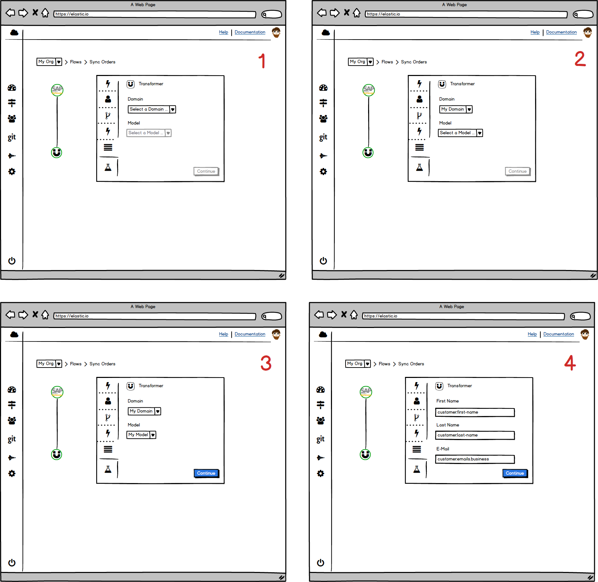

# Elastic.io Transformer User Interface

The transformer is a simple integration component that is using
the OIH API to provide a way to transform any object from any model available
in OIH. The following mockup demonstrates how such a transformer
UI would look in elastic.io integration platform.

In the mockups above an integrator wants to synchronize data between
SAP ByDesign ERP and some other proprietary software. The diagram shows
an integration flow to push data from SAP ByDesign to OIH. For that purpose
the integrator created a proprietary and private domain with a couple of
models inside it. The configuration of the transformer is performed in 3 steps:

1. Choosing a domain available in OIH (step 1 in the diagram).
2. Choosing one of the models in the given domain (step 2 in the diagram).
3. Mapping incoming data from SAP ByDesign to the chosen model (step 4 in the diagram).

## Choosing a domain

The transformer is using OIH API to fetch all the available domains from
the OIH tenant of the current integrator. These domains are presented to
the integrator in a dropdown menu.

## Choosing a model in a domain

The transformer is using OIH API to fetch all the available models for a
given domain. These models  are presented to the integrator in a dropdown
menu.

## Mapping data

Now that the model is chosen, the transformer can display the properties
of that model as a set of input fields used to map data from the model
of SAP ByDesign. This mapping is done using JSONata expressions.
